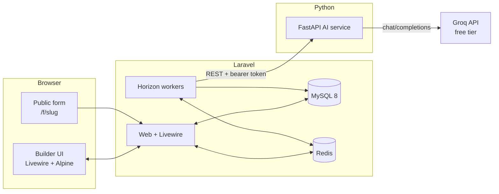
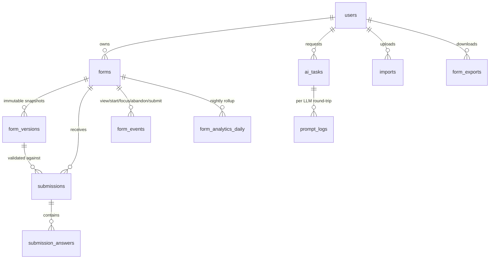

# FormForge — AI-Powered Form Builder

Build forms by hand, generate them from a sentence, or import them from Word/Excel. Share a public link, collect submissions, export CSV, and watch completion analytics — with every form defined by a single JSON schema that drives the builder, the public renderer, server-side validation, storage and exports.

> **Live demo:** https://formforge-zzoq.onrender.com &nbsp;·&nbsp; **Login:** `demo@formforge.test` / `password`

> The demo account ships with three seeded forms, ~100 submissions and 30 days of analytics.
> *Free-tier notes: the site sleeps when idle — the **first load can take ~1 minute** to wake. The hosted demo runs Postgres + a sync queue (Render's free tier has no workers/Redis); the full MySQL + Redis + Horizon stack runs via `docker compose up` — see Deployment.*

| Part | Status |
|---|---|
| **A — Core builder** | ✅ 19 field types, drag & drop + click-to-add, sections, inline edit, per-field validation config, two-way JSON editor, public URLs, server-side validation from the schema, submissions list with search + pagination, queued CSV export |
| **B — AI generation** | ✅ Prompt → queued Groq job → validated schema → builder. AI **editing** and **translation** of existing forms. Repair/retry loop, model fallback, token/latency logging |
| **C — Word/Excel import** | ✅ Deterministic parsers + AI only for ambiguous fields, preview & mapping screen, defensive error reporting, committed sample files |
| **D — Differentiators** | ✅ Versioning + rollback · conditional logic engine · completion/drop-off analytics · autosave + undo/redo · rate limiting + spam protection · Redis-cached schemas · QR share · 93 automated tests · Docker + CI |

---

## Stack

- **Laravel 11** (PHP 8.3) — auth, builder UI (**Livewire 3** + Alpine + Tailwind), validation, submissions, queues (**Redis** + **Horizon**), MySQL 8
- **FastAPI** (Python 3.12) — the only component that talks to the LLM
- **Groq** — free-tier `llama-3.3-70b-versatile`, fallback `llama-3.1-8b-instant`. **No paid providers.**
- Laravel ⇄ FastAPI over REST with a shared bearer token



Long LLM calls never block a web request: the UI creates an `ai_tasks` row, a queued job calls the AI service, and Livewire polls the row (`wire:poll`) until it completes.

---

## Quick start

### Docker (one command)

```bash
cp .env.example .env                 # set APP_KEY (php artisan key:generate --show) + AI_SERVICE_TOKEN
cp ai-service/.env.example ai-service/.env   # paste your free GROQ_API_KEY
docker compose up -d --build
# → http://localhost:8080  (demo login above; demo data auto-seeded)
```

### Manual dev

```bash
# 1. Laravel
cd web
composer install && npm install && npm run build
cp .env.example .env && php artisan key:generate
php artisan migrate --seed           # needs MySQL 8 + Redis running
php artisan serve --port 8090
php artisan queue:work               # separate terminal (Horizon needs Linux)

# 2. AI service
cd ai-service
python -m venv .venv && .venv/bin/pip install -r requirements.txt
cp .env.example .env                 # paste GROQ_API_KEY + shared token
.venv/bin/uvicorn app.main:app --port 8001
```

### Environment variables

| Laravel (`web/.env`) | Purpose |
|---|---|
| `DB_*` | MySQL 8 connection |
| `REDIS_*`, `QUEUE_CONNECTION=redis`, `CACHE_STORE=redis` | queues + schema cache |
| `AI_SERVICE_URL` / `AI_SERVICE_TOKEN` / `AI_SERVICE_TIMEOUT` | FastAPI service address + shared secret |
| `FORM_SUBMISSION_RATE_LIMIT`, `AI_GENERATION_RATE_LIMIT` | abuse limits |

| AI service (`ai-service/.env`) | Purpose |
|---|---|
| `GROQ_API_KEY` | **the only LLM credential in the system** (free at console.groq.com) |
| `GROQ_MODEL_PRIMARY` / `GROQ_MODEL_FALLBACK` | both free Groq models |
| `AI_SERVICE_TOKEN` | must equal the Laravel value |
| `MAX_REPAIR_ATTEMPTS` | LLM retry budget (default 3) |

No secret is ever committed — `.env.example` files document everything.

---

## The schema is the single source of truth

Every form is one JSON document (contract in [docs/SCHEMA.md](docs/SCHEMA.md)):

```jsonc
{
  "schema_version": 1,
  "title": "Job Application",
  "settings": { "submit_label": "Apply", "success_message": "…" },
  "sections": [{
    "id": "sec_x1", "title": "Personal details",
    "fields": [{
      "id": "fld_a1", "key": "email", "type": "email", "label": "Email",
      "required": true, "options": null,
      "validation": { "min_length": null, "max_length": 320, "regex": null, "...": null },
      "logic": { "action": "show", "match": "all",
                 "conditions": [{ "field": "position", "operator": "equals", "value": "senior" }] }
    }]
  }]
}
```

Everything derives from it — nothing defines a field twice:

| Consumer | Mechanism |
|---|---|
| Builder canvas & settings panel | Livewire renders/mutates the draft schema |
| Public form | Blade partial per `type`, Alpine mirrors `logic` client-side |
| **Server validation** | `ValidationRuleCompiler` compiles the schema into Laravel rules per request; `ConditionEvaluator` decides visibility from the *submitted* values — a logic-hidden field is never validated and its value is discarded, whatever the browser sends |
| Storage | answers keyed by `field.key`, pinned to the exact `form_version_id` |
| CSV export | columns in schema order, labels as headers |
| AI service | Pydantic mirror of the same contract validates LLM output |

**Every write path** (builder autosave, JSON editor, AI results, import commits) funnels through one `FormService` chain: `SchemaSanitizer` (strip unknown props/HTML, dedupe keys; *lenient mode* additionally repairs LLM/import quirks) → `FormSchemaValidator` (structural + semantic checks with JSON paths) → persist. **An invalid schema is never stored.**

---

## Data model



- `form_versions.schema_json` holds the schema; **sections/fields exist only inside it** (a `sections` table would duplicate field definitions).
- `forms.published_version_id` points at the live snapshot; editing a published form opens the next draft version; rollback publishes an old schema as a **new** version.
- `submission_answers` is a queryable EAV row per answer (`value_text` for scalars, `value_json` for checkbox/address/file), denormalised with `form_id`.

**Indexes that matter at scale** (in the migrations):

| Index | Query it serves |
|---|---|
| `forms (user_id, status, updated_at)` | dashboard listing per user |
| `forms.public_id` unique | public URL lookup — the hottest read (plus a Redis cache in front) |
| `form_versions (form_id, version)` unique | version history, integrity |
| `submissions (form_id, submitted_at)` | submissions table, newest first, paginated |
| `submission_answers (submission_id, field_key)` unique | render one submission |
| `submission_answers (form_id, field_key)` | per-field analytics/exports without joining through submissions |
| `form_events (form_id, event, created_at)` | funnel counts by day |
| `form_analytics_daily (form_id, date)` unique | idempotent rollup upserts |

`form_events` is append-only and prunable: a nightly queued job rolls it into `form_analytics_daily` and deletes aggregated events past 90 days, so the hot table stays small.

---

## API endpoints

**Laravel (web):**

| Route | What |
|---|---|
| `GET /f/{public_id}` | public form (published only) |
| `POST /f/{public_id}` | submit — throttled per form+IP, honeypot + min-fill-time |
| `POST /f/{public_id}/event` | funnel beacons (start / field_focus / abandon) |
| `GET /dashboard`, `/forms/{uuid}/builder`, `/preview`, `/submissions`, `/versions`, `/analytics` | authed app (Livewire) |
| `GET /forms/ai`, `/forms/import` | AI generation page, import wizard |
| `GET /exports/{uuid}/download` | finished CSV (owner only) |
| `GET /horizon` | queue dashboard (demo user allowed) |

**AI service (FastAPI, bearer token, OpenAPI: [docs/ai-service-openapi.json](docs/ai-service-openapi.json)):**

| Route | What |
|---|---|
| `GET /health` | provider/model/key status |
| `POST /v1/forms/generate` | `{prompt, locale?}` → validated schema + telemetry |
| `POST /v1/forms/edit` | `{prompt, schema}` → full updated schema |
| `POST /v1/forms/translate` | `{target_language, schema}` → labels translated, keys/values untouched |

---

## AI prompt strategy

1. **System prompt = the contract, three ways.** Prose rules, the exact allowed type list, and a *worked JSON example* (small models follow examples far better than rules). JSON mode (`response_format: json_object`) is on; temperature 0.3.
2. **Deterministic repair before any token is spent.** Markdown fences, leading prose, trailing commas, and truncated output (stack-based bracket closing) are fixed locally.
3. **Validate, then feed errors back.** Output must parse into the Pydantic contract mirror. On failure the *same conversation* continues: "your response failed with these errors → return the corrected JSON only" — up to 3 total round-trips. Failures are typed (`invalid_json` / `schema_invalid` / `provider_error`).
4. **Hallucinated types are mapped, not fatal.** `"multiselect"` → checkbox, `"fullname"` → text, unknown props dropped — in the Python sanitiser and again (lenient mode) in PHP. Defence in depth: Laravel re-validates everything the service returns.
5. **Free-tier reality.** Groq TPM rate limits are honoured: the service waits out the `try again in Xs` hint once, then falls back to the second free model. Edit/translate prompts embed the schema as *compact* JSON (~30% fewer tokens).
6. **Editing contract.** "Return the COMPLETE schema; preserve ids/keys/settings unless the instruction says otherwise; unrelated instruction → return unchanged." Translation may touch only human-visible strings.
7. **Everything is measured.** Every round-trip logs model, outcome, latency and token counts → `prompt_logs`; task totals on `ai_tasks`, surfaced in the UI.

## Import strategy (hybrid)

**Deterministic first** — Word: Heading 1/2 → sections; question-like paragraphs → fields; bullet/☐ lists → options (checkbox when the label says "select all", radio otherwise); `Label: ____` → text; trailing `*`/`(required)` → required; 2-column tables → label/type rows. Excel: a **structured question sheet** (`Label`+`Type` headers, optional Key/Required/Options/Placeholder/Help/Section/Min/Max, friendly aliases like `multiselect`, `yes/no`, `paragraph`) *and* a **plain header-row sheet** where sample data rows drive inference (`filter_var` email/URL, numeric, date, phone patterns).

**AI only where parsing was unsure.** Each field carries a confidence flag; low-confidence fields (and only those) go to the AI with "don't add/remove fields, don't touch keys or labels". If the AI is down or wrong, the deterministic result stands — `ai_used` is recorded per import.

**The user always reviews.** The mapping screen shows every field (editable type/key/label/required/options/section, include-toggle), highlights guessed types, and lists unparseable blocks verbatim. Nothing becomes a form until commit. Garbage files are rejected with a clear error (no silent CSV fallback). Samples in [samples/](samples/).

---

## Security

- **Never trust the browser:** validation rules and conditional visibility are recomputed server-side from the stored schema on every submission.
- Per-form+IP submission throttling, per-IP beacon throttling, per-user hourly AI quota.
- Honeypot field + minimum-fill-time check (instant submits get a fake success page and store nothing).
- Schema sanitisation strips HTML from every label/description; Blade escapes on output; the JSON editor cannot inject unknown properties past the sanitizer.
- Password-type answers encrypted at rest (decrypted only in the owner's UI; masked in CSV). IPs stored as salted hashes, not raw.
- CSRF on all forms; policies enforce owner-only access to forms, submissions, exports; uploads validated by extension/size and stored on the private disk.

## Testing

**93 tests**: 71 Pest (231 assertions — schema engine, lifecycle, public forms incl. conditional/honeypot behaviour, builder authorization + autosave + JSON editor, AI flow against a faked service, import parsers pinned to the committed samples, CSV export) + 22 pytest (JSON repair, contract validation, endpoint auth, repair-loop behaviour with a scripted fake Groq).

```bash
cd web && php artisan test          # SQLite in-memory, no services needed
cd ai-service && python -m pytest   # no Groq key needed (faked client)
```

CI (GitHub Actions) runs both suites on every push/PR.

## Deployment

Docker images for both services (`web/Dockerfile` multi-stage with baked assets, `ai-service/Dockerfile`) plus `docker-compose.yml` (web + horizon + scheduler + mysql + redis + ai). On **Railway**: create MySQL + Redis plugins, deploy `web/` and `ai-service/` as two services from the repo, set the env tables above, add `php artisan horizon` and `php artisan schedule:work` as separate processes from the same image. Any Docker host works the same way.

## Known limitations

- Single-owner forms (no teams/roles); multi-tenant scoping is by `user_id`.
- File answers live on local disk — S3 is a config change (`FILESYSTEM_DISK`) away but untested.
- The public form is single-page (sections are visual groups, not wizard steps).
- Signature answers store as data-URI PNGs (capped at ~200KB) rather than files.
- AI translation replaces labels in-place (a new version — rollback works) rather than storing parallel locales.
- Undo/redo history is per-browser-session (client memory), not persisted.

## Credits

Laravel, Livewire, Tailwind, Alpine, SortableJS, qrcode-generator, PhpWord, PhpSpreadsheet, FastAPI, Pydantic, httpx, Pest, pytest — and Groq's free tier. Built with AI assistance; every line is explainable in a walkthrough.
