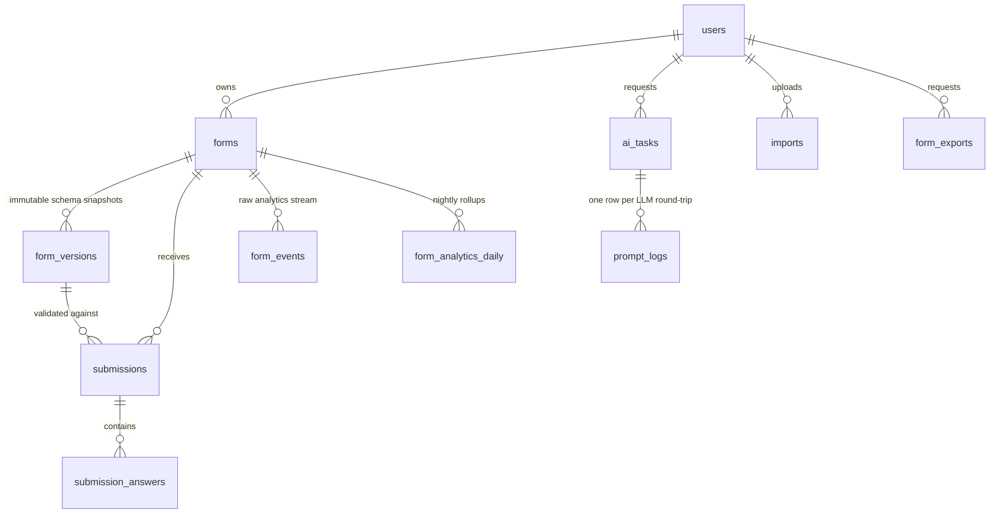

# Database Design

MySQL 8 is the reference engine (docker-compose, migrations, SQL types); the schema is intentionally portable and runs unmodified on PostgreSQL 16 (the hosted demo) and SQLite (the test suite) — proven by CI.

## Entity-relationship overview

## Core principle: the schema is data, versions are immutable

- `form_versions.schema_json` holds the complete form definition. **Sections and fields exist only inside it** — a relational copy would duplicate field definitions and drift (see DECISIONS.md).
- A published version is never edited. `forms.published_version_id` points at the live snapshot; editing a published form opens the next draft version; **rollback publishes a copy of an old schema as a new version**, so history is never rewritten.
- Every submission stores `form_version_id` — the exact snapshot it was validated against — so answers render correctly forever, regardless of later edits.

## Tables

| Table | Purpose / notable columns |
|---|---|
| `users` | Breeze default. Ownership is the tenant boundary |
| `forms` | `uuid` (app routing), `public_id` (10-char public slug), denormalised `title`/`status`/counters for dashboards, `settings` JSON, `published_version_id`, soft deletes |
| `form_versions` | `version` int, `schema_json`, `status` (draft/published/superseded), `source` (manual/ai/import/rollback), `label` changelog line |
| `submissions` | version pin, salted `ip_hash` (no raw IPs), UA/referrer, `started_at`/`submitted_at`/`duration_seconds` from the encrypted render token |
| `submission_answers` | **EAV row per answer**: `field_key`, `field_type`, `value_text` (scalars, searchable) or `value_json` (checkbox arrays, address objects, file metadata). Denormalised `form_id` |
| `ai_tasks` | one row per generate/edit/translate request: prompt, input/result schemas, status, model, token counts, latency, attempts |
| `prompt_logs` | one row per LLM round-trip (incl. failed repairs): model, outcome, tokens, latency, response excerpt |
| `imports` | uploaded file metadata, parser output (`parsed_schema`), unparseable-block report (`issues`), `ai_used` flag, lifecycle status |
| `form_events` | append-only funnel stream: `view`/`start`/`field_focus`/`abandon`/`submit` with anonymous `visitor_id` cookie |
| `form_analytics_daily` | idempotent nightly rollups: views/starts/submissions/unique visitors/avg duration/drop-off map per form per day |
| `form_exports` | queued CSV export lifecycle + stored path |

## Indexes (and the exact query each serves)

| Index | Serves |
|---|---|
| `forms (user_id, status, updated_at)` | dashboard listing, filtered by status, newest first |
| `forms.public_id` UNIQUE | public URL lookup — hottest read (fronted by a Redis/DB schema cache) |
| `forms.title` | dashboard search (prefix LIKE) |
| `form_versions (form_id, version)` UNIQUE | version history + integrity |
| `form_versions (form_id, status)` | "current draft" lookup on every builder save |
| `submissions (form_id, submitted_at)` | submissions table, newest first, paginated |
| `submissions (form_id, ip_hash)` | spam/dedup checks |
| `submission_answers (submission_id, field_key)` UNIQUE | render one submission; guards double answers |
| `submission_answers (form_id, field_key)` | per-field analytics & CSV export **without** joining through submissions |
| `form_events (form_id, event, created_at)` | funnel counts per day |
| `form_events (form_id, visitor_id)` | view/start dedup per visitor |
| `form_analytics_daily (form_id, date)` UNIQUE | idempotent rollup upserts |
| `ai_tasks (user_id, status, created_at)` / `imports (…)` / `form_exports (user_id, created_at)` | per-user task lists + polling |

## Scale strategy

`form_events` is the only unbounded-growth table and it is **append-only and prunable**: the scheduled `AggregateAnalyticsJob` (nightly 01:10) rolls events into `form_analytics_daily` and deletes aggregated events older than 90 days. Dashboards read raw events at demo scale and switch to the rollup table at real scale — the swap point is one service class (`AnalyticsService`).

## Migrations, seeders, factories

- 13 migrations (`web/database/migrations`) — Laravel framework tables + 10 domain tables, every index above declared in-migration.
- `DemoSeeder` builds the reviewer environment: demo account, three realistic forms (conditional logic, file upload, ratings), ~100 submissions with typed answers, and 30 days of funnel events. Idempotent — safe on every container boot.
- Factories for `Form`, `FormVersion`, `Submission` power the test suite.
- A SQL dump is deliberately **not** committed (see DECISIONS.md); regenerate one with `docker exec formforge-mysql mysqldump -uroot -proot formforge > dump.sql`.
